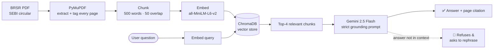
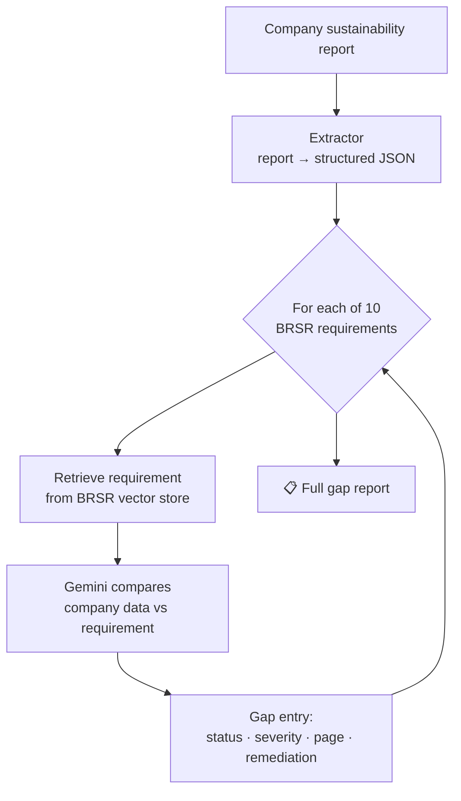

<h1 align="center">🌱 AI ESG Tool — <i>Priya &amp; Raga</i></h1>

<p align="center">
  <b>Document-grounded ESG &amp; BRSR compliance assistants for Indian companies</b><br/>
  Answers drawn <b>straight from the official SEBI circular — with exact page citations.</b><br/>
  <i>Built to make an LLM <b>trustworthy</b> in a regulated setting, not just conversational.</i>
</p>

<p align="center">
  
  
  
  
  
  
</p>

---

## 💡 Why this matters

SEBI mandates **BRSR** (Business Responsibility & Sustainability Reporting) for India's **top 1,000 listed companies**. Compliance teams have to map hundreds of disclosures onto a dense regulatory circular — slow, manual, and error-prone.

A generic chatbot is *dangerous* here: if it hallucinates a requirement or invents a page number, it's worse than no tool at all.

**This project takes the opposite stance — grounding over fluency:**
- ✅ Every answer is pulled from the **actual source document** and **cites the page** it came from.
- ✅ If the answer isn't in the document, the assistant **refuses** instead of guessing.
- ✅ Compliance gaps are returned as **structured, severity-graded data** — not prose you have to re-read.

---

## 🧩 What's inside

Four components, escalating from a single prompt to an automated auditor:

| # | Component | File | What it does |
|---|-----------|------|--------------|
| 1 | **ESG Domain Specialist** | `first_gemini_call.py` | A focused Gemini call recommending which **GRI standards** a mid-sized Indian waste-management company should prioritise. The "hello world" of domain prompting. |
| 2 | **Priya — ESG Analyst** | `prompt_engineering.py` | A persona-driven analyst that answers ESG questions **and** extracts messy sustainability reports into a strict **JSON schema** (emissions, waste, safety, completeness). |
| 3 | **Raga — Grounded Compliance (RAG)** | `raga.py` | Retrieval-augmented Q&A over the **BRSR PDF**. Answers *only* from retrieved excerpts, cites the section, and refuses when the answer isn't present. |
| 4 | **Raga — Automated BRSR Auditor** ⭐ | `brsr_assistant/` | The flagship: extracts a company's data, then checks it against **10 core BRSR requirements**, returning a structured **gap report** — status, severity, the requiring page, and remediation. |

---

## 🏗️ Architecture

### Grounded Q&A pipeline (Raga)



### Automated gap analysis (BRSR Auditor)



---

## 🔍 Example: grounded answer *(illustrative)*

> **Q:** *"What are the key environmental disclosures required?"*
>
> **Raga:** Based on the BRSR document, the key environmental disclosures include energy consumption (renewable vs. non-renewable), water withdrawal & discharge by source, Scope 1 and Scope 2 GHG emissions, and waste generated by category with disposal methods. — *cited from Principle 6, p. 14–16*
>
> **Out-of-scope question →** Raga responds with its exact refusal string rather than guessing:
> *"I couldn't find specific information about that in the loaded documents. Please check the source document directly or rephrase your question."*

## 🧾 Example: automated gap report *(illustrative — real output schema)*

```json
{
  "requirement": "Scope 1 and Scope 2 GHG emissions reporting requirement",
  "status": "MISSING",
  "severity": "CRITICAL",
  "what_company_reported": null,
  "what_brsr_requires": "Disclosure of total Scope 1 and Scope 2 emissions and intensity",
  "brsr_page": "12",
  "gap_description": "No greenhouse-gas emissions data disclosed in the report.",
  "remediation": "Calculate and report Scope 1 (direct) and Scope 2 (purchased energy) emissions using the GHG Protocol."
}
```

---

## 🧠 How hallucination is engineered out

This is the part that matters for a regulated domain:

- **Strict grounding prompt** — the model is instructed to answer *only* from the `<context>` excerpts, and to return a fixed refusal string otherwise.
- **Page-tagged chunks** — every page is wrapped as `[Page N]` *before* chunking, so the citation survives retrieval and lands in the answer.
- **Semantic retrieval** — `all-MiniLM-L6-v2` embeddings in **ChromaDB**, top-_k_ search, **500-word chunks with 50-word overlap** to preserve context across boundaries.
- **Severity-graded output** — gaps are classified **CRITICAL / IMPORTANT / MINOR** so a compliance team can triage at a glance.

---

## 🛠️ Tech stack

`Python 3.11+` · `Google Gemini (google-genai)` · `ChromaDB` · `Sentence-Transformers` · `PyMuPDF` · domain knowledge across **GRI / SASB / BRSR**

## ▶️ Setup & run

```bash
# 1. Clone
git clone https://github.com/KNPratyusha/ai-esg-tool.git
cd ai-esg-tool

# 2. Virtual environment
python3 -m venv venv && source venv/bin/activate

# 3. Install dependencies
pip install google-genai chromadb pymupdf sentence-transformers

# 4. Gemini API key (free at https://aistudio.google.com)
export GEMINI_API_KEY="your-key-here"

# 5. Run any component
python first_gemini_call.py            # 1 · ESG domain specialist
python prompt_engineering.py           # 2 · Priya — analyst + JSON extraction
python raga.py                         # 3 · Raga — grounded BRSR Q&A
python brsr_assistant/gap_analyser.py  # 4 · Raga — automated gap analysis
```

> The BRSR auditor reads `brsr.pdf` from the repo root by default — override with `export BRSR_PDF=/path/to/your.pdf`.

---

## 🗺️ Roadmap

- [x] **Faithfulness eval harness** — scores answer groundedness + refusal accuracy with an LLM-as-judge → see [`evals/`](evals/). *(run it to populate the scorecard with your numbers)*
- [ ] **Streamlit UI** so non-technical compliance teams can use it.
- [ ] Extend the grounded corpus beyond BRSR to **GRI** and **SASB**.

## 📄 Data & disclaimer

`brsr.pdf` is the public SEBI BRSR circular, included for reproducibility. Outputs are **decision-support, not legal advice.**
